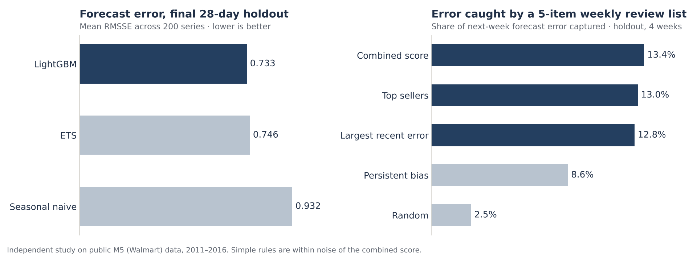

# Walmart demand planning: forecast reliability and weekly review priorities

An independent historical study on **public M5 data** (Walmart daily unit sales, 2011–2016). It asks two planner questions:

1. Which 28-day daily forecasts can be trusted?
2. Which five product-store series should a planner review each week?

This is not Walmart work. Nothing was deployed, and no savings, stockout or planner-impact claims are made.

## Results at a glance



**Portfolio case study:** https://hemant-singla.github.io/projects/walmart.html

| | LightGBM | ETS | Seasonal naive |
|---|---|---|---|
| Mean RMSSE, 6 validation periods | **0.674** | 0.688 | 0.889 |
| Mean RMSSE, final 28 days (holdout) | **0.733** | 0.746 | 0.932 |
| Bias, holdout | −4.9% | −6.8% | −10.6% |

- **Ranges:** 90% forecast ranges contained 90.9% (validation) and 89.3% (holdout) of actuals.
- **Weekly review list:** five picks capture about 13–16% of next-week forecast error, against 2.5% for random picks. The tuned combined score did **not** clearly beat the simple rules: 13.4% combined, 13.0% top sellers and 12.8% largest recent error on the holdout. The recommendation is the simple rule.
- **Two goals:** to catch forecasts that are unusually bad for a given item, rank by normalised error. That list scores 60% precision, against roughly 10% for unit-ranked lists.
- **Failure case:** items returning after long zero-sales runs. FOODS_3_444_CA_1 had 333 days with no sales, then sold 414 units against a forecast of 3. Every rule missed it.

Full detail: `docs/memo.md` (2-page decision memo), `PROGRESS.md` (checkpoint log), `deck/` (project review slides), `powerbi/` (dashboard).

## Repository layout

```
config/windows.json            date windows fixed before modelling; frozen_choices.json written before the holdout
sql/01_load_audit.sql          DuckDB: load, join, 26 audit checks, model input
sql/02_analytics.sql           DuckDB: independent recomputation of all reported metrics
sql/03_business_context.sql    DuckDB: company-wide context tables from the full raw sales file
src/wdp/                       data loading, features, models (naive, ETS, LightGBM), metrics, intervals, priority rules
scripts/                       one script per checkpoint step (see below)
tests/test_temporal.py         8 leakage / baseline / metric edge-case tests
results/                       every saved result (see docs/source_dictionary.md)
powerbi/                       Power BI project (.pbip): 10 pages, generated by build_pbip.py
docs/                          memo, interview walkthrough, source dictionary
deck/                          project review PowerPoint and its generator
environment/                   exact versions used on each machine
```

## Reproduce (Windows, from the project folder)

```powershell
python -m venv .venv
.venv\Scripts\Activate.ps1
pip install -r requirements.txt
```

Raw data must be in `data/raw/` (`python scripts/download_data.py` downloads it and verifies checksums; `python scripts/prepare_data.py` builds `data/prepared/`).

| Step | Command | Time |
|---|---|---|
| 1 SQL load + audit | `python scripts/run_sql.py sql/01_load_audit.sql --scope pilot` then `--scope panel` | < 1 min |
| 2 Verify audit | `python scripts/checkpoint1_verify.py` | seconds |
| 3 Tests | `python tests/test_temporal.py` | < 1 min |
| 4 Pilot | `python scripts/checkpoint2_pilot.py` | ~15 s |
| 5 Tuning | `python scripts/checkpoint3_tune.py` | ~3 min |
| 6 Weekly backtest | `python scripts/checkpoint3_backtest.py` (resumable) | ~30 min |
| 7 Model choice + ranges | `python scripts/checkpoint3_evaluate.py` | seconds |
| 8 Priority experiment + freeze | `python scripts/checkpoint4_priority.py` | ~1 min |
| 9 Holdout (once) | `python scripts/checkpoint4_holdout.py` | ~2 min |
| 10 SQL recompute + reconcile | `python scripts/run_sql.py sql/02_analytics.sql` then `python scripts/reconcile.py` | < 1 min |
| 11 Company context | `python scripts/run_sql.py sql/03_business_context.sql` | ~2 min |
| 12 Dashboard tables | `python scripts/build_dashboard_data.py` | seconds |
| 13 Power BI project | `python powerbi/build_pbip.py` | seconds |
| Optional | `python scripts/ets_crosscheck_statsmodels.py` (ETS vs statsmodels, validation only) | minutes |

All saved results are already in `results/`, so steps 6 and 9 do not need rerunning. `run_sql.py` uses the `duckdb` Python package, or a DuckDB command-line binary given in `DUCKDB_CLI`.

## Open the dashboard

Open `powerbi/Walmart_Demand_Planning.pbip` in Power BI Desktop, then **Refresh**. If the project moved, change the `DataFolder` parameter (Transform data → Manage parameters) to the new `...\powerbi\data\` path.

## Rules this project follows

- **Time cutoffs.** Every forecast and list uses only data up to its date. LightGBM training targets are dated on or before the forecast date. Price is the last completed week's price.
- **Holdout.** The final 28 days were sealed in code until `config/frozen_choices.json` was written with a SHA-256 fingerprint, then used once.
- **Missing data.** Missing prices are kept missing (all are before launch). Zero sales are not treated as stockouts.
- **Known limits.** There is no inventory, lead-time, margin or override data. The panel covers 2 stores and 2 categories and excludes sparse and new items. Panel RMSSE is not the official M5 WRMSSE. ETS is hand-written in numpy because statsmodels was unavailable where the models ran; a cross-check script is provided.

## Data terms

M5 data comes from the Kaggle competition, via the Zenodo mirror. Raw files are kept local and excluded from Git. Check the original data terms before redistributing any of it.
